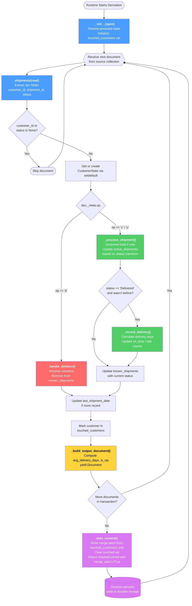

```mermaid
flowchart TD
    Start([Runtime Starts Derivation]) --> Init["<b>__init__(open)</b><br/>Restore persisted state<br/>Initialize touched_customers set"]
    
    Init --> ReadLoop{{"Receive next document<br/>from source collection"}}
    
    ReadLoop --> Shipments["<b>shipments(read)</b><br/>Extract doc fields:<br/>customer_id, shipment_id, status"]
    
    Shipments --> Validate{customer_id or<br/>status is None?}
    Validate -- Yes --> Skip([Skip document]) --> ReadLoop
    Validate -- No --> GetState["Get or create<br/>CustomerState via setdefault"]
    
    GetState --> CheckOp{doc._meta.op}
    
    CheckOp -- "op == 'd'" --> HandleDel["<b>_handle_deletion()</b><br/>Reverse counters<br/>Remove from known_shipments"]
    CheckOp -- "op == 'c' / 'u'" --> Process["<b>_process_shipment()</b><br/>Increment total if new<br/>Update active_shipments<br/>based on status transition"]
    
    Process --> IsDelivered{status == 'Delivered'<br/>and wasn't before?}
    IsDelivered -- Yes --> RecordDel["<b>_record_delivery()</b><br/>Calculate delivery days<br/>Update on_time / late counts"]
    IsDelivered -- No --> UpdateTracking["Update known_shipments<br/>with current status"]
    RecordDel --> UpdateTracking
    
    HandleDel --> UpdateDate
    UpdateTracking --> UpdateDate["Update last_shipment_date<br/>if more recent"]
    
    UpdateDate --> Touch["Mark customer in<br/>touched_customers"]
    Touch --> BuildOut["<b>_build_output_document()</b><br/>Compute avg_delivery_days, is_vip<br/><i>yield Document</i>"]
    
    BuildOut --> MoreDocs{More documents<br/>in transaction?}
    MoreDocs -- Yes --> ReadLoop
    
    MoreDocs -- No --> StartCommit["<b>start_commit()</b><br/>Build merge patch from<br/>touched_customers only<br/>Clear touched set<br/>Return StartedCommit with<br/>merge_patch=True"]
    
    StartCommit --> Persisted[(Runtime persists<br/>state to durable storage)]
    Persisted --> ReadLoop

    style Init fill:#4a9eff,color:#fff
    style Shipments fill:#4a9eff,color:#fff
    style HandleDel fill:#ff6b6b,color:#fff
    style Process fill:#51cf66,color:#fff
    style RecordDel fill:#51cf66,color:#fff
    style BuildOut fill:#ffd43b,color:#000
    style StartCommit fill:#da77f2,color:#fff
    style Persisted fill:#da77f2,color:#fff
```