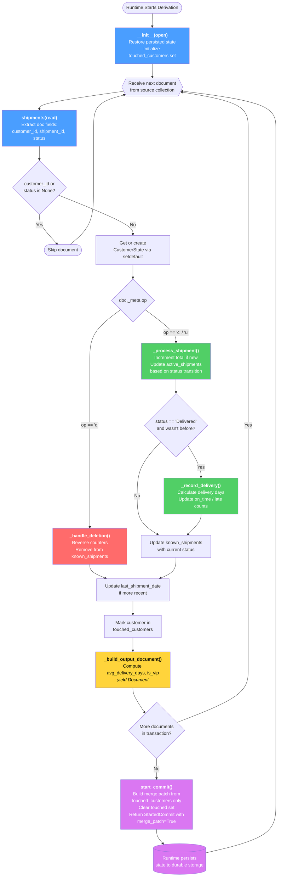

# Stateful Python Derivation in Estuary: Per-Customer Shipping Metrics with Persisted State and JSON Merge-Patch

A stateful [Python derivation](https://docs.estuary.dev/concepts/derivations/) for [Estuary](https://estuary.dev) that aggregates a real-time stream of shipment CDC events into a continuously-updated profile per customer. It restores persisted state when the task starts, maintains an in-memory aggregate as documents arrive, correctly handles CDC create/update/delete operations and status transitions (e.g. `In Transit` → `Delivered`) without double-counting, and durably persists only the customers it touched each transaction via a **JSON merge patch**.

The derived collection emits one document per `customer_id` with running counters: `total_shipments`, `on_time_count`, `late_count`, `active_shipments`, `avg_delivery_days`, `is_vip`, and `last_shipment_date`.

## Architecture

This project defines a single Estuary collection — a Python **derivation** — that reads from an upstream shipments collection and writes per-customer metrics:

```
source collection                       derived collection
Artificial-Industries/                  dani-demo/python-derivations/
postgres-shipments/      ──shuffle──▶    customer-metrics
public/shipments         /customer_id   (key: /customer_id)
(CDC: create/update/delete)             one doc per customer, updated in real time
```

- **Source:** `Artificial-Industries/postgres-shipments/public/shipments` — a collection produced upstream by a PostgreSQL CDC capture (see the [../../shipments-datagen](../../shipments-datagen) example or repoint at your own collection).
- **Transform:** a single transform named `shipments`, shuffled on `/customer_id` so each customer's state lives on exactly one worker. State is partitioned by the shuffle key, which is what makes the aggregation horizontally scalable.
- **Derived collection:** `dani-demo/python-derivations/customer-metrics`, keyed on `/customer_id`. Because the collection is keyed by customer, each emitted document replaces the previous version for that customer.

The lifecycle of the derivation — restore state, process each document, persist a merge patch on commit — is shown below.



## What it computes

For each `customer_id`, the derivation maintains a `CustomerState` and emits a document conforming to `customer-metrics.schema.yaml`:

| Field | Type | Meaning |
| --- | --- | --- |
| `customer_id` | integer | Unique customer identifier (collection key) |
| `total_shipments` | integer | Total shipments seen for this customer |
| `on_time_count` | integer | Shipments delivered on or before `expected_delivery_date` |
| `late_count` | integer | Shipments delivered after `expected_delivery_date` |
| `active_shipments` | integer | Shipments currently `In Transit` / `At Checkpoint` / `Out For Delivery` |
| `avg_delivery_days` | number \| null | Mean days from creation to delivery (`total_delivery_days / delivered_count`) |
| `is_vip` | boolean | `true` when `total_shipments >= 10` (the `VIP_THRESHOLD`) |
| `last_shipment_date` | string (date) \| null | Date of the customer's most recent shipment |

The `required` fields in the derived schema are `customer_id` and `total_shipments`.

## The stateful pattern

This example demonstrates the full stateful-derivation contract. The relevant code lives in [`customer-metrics.flow.py`](customer-metrics.flow.py).

### 1. Restore state on startup — `__init__(open)`

The runtime calls `__init__` with a `Request.Open` whenever the task starts or restarts. `open.state` holds whatever was returned from the previous `start_commit()` (an empty dict on the very first run). The derivation rehydrates it into Pydantic models:

```python
def __init__(self, open: Request.Open):
    super().__init__(open)
    self.state = State(**open.state)          # restore persisted per-customer metrics
    self.touched_customers: dict[int, CustomerState] = {}
```

`State` and `CustomerState` are `pydantic.BaseModel`s, which gives automatic JSON serialization for persistence plus validation. `known_shipments: dict[int, str]` inside each `CustomerState` records the last-seen status of every shipment so that CDC transitions and deletions can be reconciled without double-counting.

### 2. Process documents — `shipments(read)`

The `async def shipments(self, read) -> AsyncIterator[Document]` method runs once per source document. It:

- Skips documents missing `customer_id` or `shipment_status` instead of crashing.
- Uses `self.state.customers.setdefault(customer_id, CustomerState())` to get-or-create per-customer state.
- Branches on the CDC operation `doc.m_meta.op` (`doc._meta.op`): `d` (delete) reverses the shipment's contribution via `_handle_deletion()`; `c`/`u` (create/update) apply it via `_process_shipment()`.
- Tracks status transitions using the previously-seen status so `active_shipments` is adjusted correctly, and records on-time vs. late delivery when a shipment first reaches `Delivered`.
- Records the customer in `self.touched_customers`, then `yield`s the customer's current metrics as an output `Document`.

### 3. Persist a merge patch — `start_commit()`

At the end of each transaction the runtime calls `start_commit()`. Rather than rewriting the entire state, this derivation returns **only the customers it touched** as a JSON merge patch:

```python
return Response.StartedCommit(
    state=Response.StartedCommit.State(
        updated={"customers": {str(cid): c.model_dump()
                               for cid, c in self.touched_customers.items()}},
        merge_patch=True,   # merge with existing state, don't replace it
    )
)
```

With `merge_patch=True`, keys present in the update replace the corresponding keys in persisted state; unmentioned keys are left untouched. This scales to millions of customers with only thousands changing per transaction. The `touched_customers` set is cleared for the next transaction.

### 4. Reset for tests — `reset()`

`async def reset()` clears all state between catalog tests so state from one test doesn't leak into the next.

## What's included

| File | Role |
| --- | --- |
| [`flow.yaml`](flow.yaml) | Catalog spec for the derived collection `dani-demo/python-derivations/customer-metrics`: its `schema`, `key` (`/customer_id`), `using.python.module: customer-metrics.flow.py`, and the `shipments` transform sourced from `Artificial-Industries/postgres-shipments/public/shipments`, shuffled on `/customer_id`. |
| [`customer-metrics.flow.py`](customer-metrics.flow.py) | The `Derivation(IDerivation)` class — `__init__`, the `shipments` transform, the `_handle_deletion` / `_process_shipment` / `_record_delivery` / `_build_output_document` helpers, `start_commit`, and `reset`. |
| [`customer-metrics.schema.yaml`](customer-metrics.schema.yaml) | JSON Schema for the derived documents. Estuary validates every emitted document against it. |
| [`pyproject.toml`](pyproject.toml) | Python project metadata: `requires-python = ">=3.12"`, deps `pydantic>=2.0` and `pyright>=1.1`. |
| [`pyrightconfig.json`](pyrightconfig.json) | Points Pyright at `flow_generated/python` with `strict` type checking. |
| `flow_generated/` | Auto-generated typed stubs imported at the top of the module — `IDerivation`, `Document`, `Request`, `Response`, `SourceShipments` from `dani_demo.python_derivations.customer_metrics`. Do not edit by hand; regenerate with `flowctl`. |

## Prerequisites

- A free [Estuary account](https://dashboard.estuary.dev).
- [`flowctl`](https://docs.estuary.dev/concepts/flowctl/) installed and authenticated — Python derivations are deployed and their types generated via the CLI.
- Python 3.12+ for local editing, type-checking, and catalog tests.
- An existing **source collection** for the derivation to read from. This example reads `Artificial-Industries/postgres-shipments/public/shipments`. Stand up the upstream shipments capture with the [../../shipments-datagen](../../shipments-datagen) example (PostgreSQL CDC via the [PostgreSQL capture connector](https://docs.estuary.dev/reference/Connectors/capture-connectors/PostgreSQL/)), or repoint the transform's `source` at your own collection.

## Deploy

Authenticate once, then publish this derivation. `flowctl` builds the Python module, generates types, runs any catalog tests, and deploys the derived collection.

```bash
# Authenticate once
flowctl auth login

# Publish the derivation from this folder
flowctl catalog publish --source flow.yaml --auto-approve
```

Before publishing, edit [`flow.yaml`](flow.yaml) to match your environment:

1. Rename the derived collection `dani-demo/python-derivations/customer-metrics` to a name under your own tenant.
2. Point the `shipments` transform's `source` at the real collection produced by your capture (replace `Artificial-Industries/postgres-shipments/public/shipments`).
3. Keep the import path in `customer-metrics.flow.py` aligned with the collection name — the generated package mirrors the collection path (here `dani_demo.python_derivations.customer_metrics`). After renaming, regenerate the typed stubs:

```bash
flowctl generate --source flow.yaml
```

## Verify

Confirm the derived collection is producing documents:

```bash
# Stream the derived collection (use your renamed collection name)
flowctl collections read --collection dani-demo/python-derivations/customer-metrics --uncommitted | head

# Check the task's control-plane status
flowctl catalog status dani-demo/python-derivations/customer-metrics
```

You should see one document per `customer_id` whose counters update as new shipment events arrive. You can also watch document counts climb on the collection's page in the [Estuary dashboard](https://dashboard.estuary.dev).

## Next steps

- Materialize `customer-metrics` to a warehouse or database to power dashboards — see the [materialization connectors](https://docs.estuary.dev/reference/Connectors/materialization-connectors/).
- Adjust the aggregation logic: change `VIP_THRESHOLD`, add new per-customer counters to `CustomerState`, or refine the on-time / late delivery rule in `_record_delivery`.
- Compare with the other Python derivation patterns in this repo: stateless map ([../shipments-stateless](../shipments-stateless)), streaming join ([../shipments-joins](../shipments-joins)), and ML feature engineering ([../shipments-ai](../shipments-ai)). See the parent [`../README.md`](../README.md) for an overview.

## References

- Estuary docs: https://docs.estuary.dev
- Derivations concept: https://docs.estuary.dev/concepts/derivations/
- flowctl CLI: https://docs.estuary.dev/concepts/flowctl/
- Collections: https://docs.estuary.dev/concepts/collections/
- PostgreSQL capture connector (upstream source): https://docs.estuary.dev/reference/Connectors/capture-connectors/PostgreSQL/
- Materialization connectors (downstream destinations): https://docs.estuary.dev/reference/Connectors/materialization-connectors/
